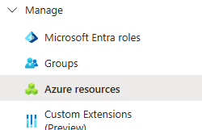
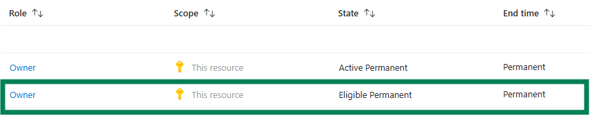

# Permanent PIM Eligible Role Assignment with Infrastructure as Code

## Introduction
This article will go over how to enable a PIM role assignment permanently without any expiration date for Azure resources with Terraform. You might encounter a 365-day limitation on PIM eligible role assignments. This article will show how to work around that.

### What I was trying to achieve
While improving our security posture, we were switching from permanent normal role assignments to PIM eligible role assignments for our Entra ID groups. While enabling PIM on these, we ran into a constraint on the maximum eligible assignment duration: Microsoft does not allow more than 365 days, so we couldn't set the assignment to have no expiration date. Our goal was to keep administrative overhead low and keep the PIM eligibility permanent on the assigned groups.

### Prerequisites

| Requirement | Details |
| --- | --- |
| Licensing | Entra ID P2 / Governance |
| Graph API permissions | `Group.Read.All`, `Group.Create` (if also creating groups), `User.Read.All` |
| Azure RBAC | User Access Administrator is sufficient at the resource group, subscription, or management group level for the identity running Terraform |
| Terraform provider version | `azurerm` 4.79.0 or later |

## Understanding the components

### PIM for Azure resources vs. Entra roles
PIM can be enabled for Entra roles such as Global Administrator, Security Reader, etc., and the scope is tenant-wide.

But PIM can also be enabled for Azure resources that handle Azure RBAC roles such as Owner, Contributor, etc., and the scope can be set to RG, subscription, or management group level.

My scenario covers PIM eligibility for Azure resources.



### Active vs. Eligible

An active assignment means the user has the role right now and can use it without any activation step. This is what a normal `azurerm_role_assignment` grants, and also what `azurerm_pim_active_role_assignment` gives but under PIM governance.

An eligible assignment means the user is allowed to hold the role but does not have it until they explicitly activate it in PIM, also known as the just-in-time (JIT) model. This is what my scenario covers, with `azurerm_pim_eligible_role_assignment`.

### Role management policy
A crucial component to understand is the role management policy. This ruleset governs how an eligible assignment or activation behaves. This policy handles multiple controls, one of which is **eligibility expiration**. This is set at the RG, subscription, or management group level and covers all assignments under the respective scope.

## Key observations

### Provider version in lock file
We had a lot of back and forth with `azurerm_pim_eligible_role_assignment` because of an older version of `azurerm` pinned in our lock file. That version's resource block didn't support all arguments — pin at least 4.79.0 (or latest) and you won't need to think about it.

### Existing management policy on the target scope
Before editing, check the management policy already set at your target scope. I was never able to find a dedicated portal view for the underlying policy object itself — the closest is [Microsoft docs](https://learn.microsoft.com/en-us/entra/id-governance/privileged-identity-management/pim-resource-roles-configure-role-settings) on Azure resource role settings, which covers the same settings from the role-settings UI. A policy applied at a higher scope, like the subscription, is inherited by every resource group beneath it; it isn't scoped to just the one resource you're editing. That inheritance might make you wonder whether a permanent eligible assignment weakens protection further down. It doesn't: permanent eligibility only changes how long a principal is allowed to stay eligible, not what happens at activation — MFA, approval, and any narrower policy set at a lower scope still apply. What changes is who's responsible for cleaning up stale eligibilities, not which controls fire.

### Dependencies
Terraform's apply order comes from resource attribute references, and here the two resources don't reference each other — they each just take `scope` and `role_definition_id` as separate input variables. Without an explicit dependency, Terraform is free to create the `azurerm_pim_eligible_role_assignment` before the `azurerm_role_management_policy` update has landed, which means the assignment gets created under whatever policy is already active on that scope. If that policy still requires an expiration, the apply fails on the same 365-day constraint from the introduction. Add `depends_on = [azurerm_role_management_policy.management_policy]` to the role assignment resource block so the policy is guaranteed to apply first.

## Terraform automation
Below is an example of how to create:
- Entra ID group
- Management policy with no expiration
- PIM eligible role assignment with no expiration

### Group creation
```hcl
# Group creation
resource "azuread_group" "group" {
  display_name     = var.group_name
  owners           = var.owners
  security_enabled = true
}
```
### Management policy creation with no expiration for PIM role assignments
```hcl
resource "azurerm_role_management_policy" "management_policy" {
  scope              = var.subscription_id
  role_definition_id = var.role_definition_id

  eligible_assignment_rules {
    expiration_required = false # Ensures expiration is not required in role assignment
  }
}
```
### PIM eligible role assignment creation without expiration
```hcl
resource "azurerm_pim_eligible_role_assignment" "pim_role_assignment" {
  scope              = var.subscription_id
  role_definition_id = var.role_definition_id
  principal_id       = var.principal_id
  depends_on         = [azurerm_role_management_policy.management_policy] # ensures assignment is compliant with new management policy
}
```

### IAM overview in portal
Below is a side-by-side representation of how this looks like in the azure portal under IAM.



## Conclusion
If I did this again, I would understand and check the existing role management policy before touching anything. This is the most crucial part of the setup and requires a good understanding of the backend governance that is not visible in the Entra ID portal.

That upfront effort only pays off if you're repeating it: I'd recommend this approach to any team managing role assignments at scale, but not necessarily for a single role assignment — such a setup would be overkill.